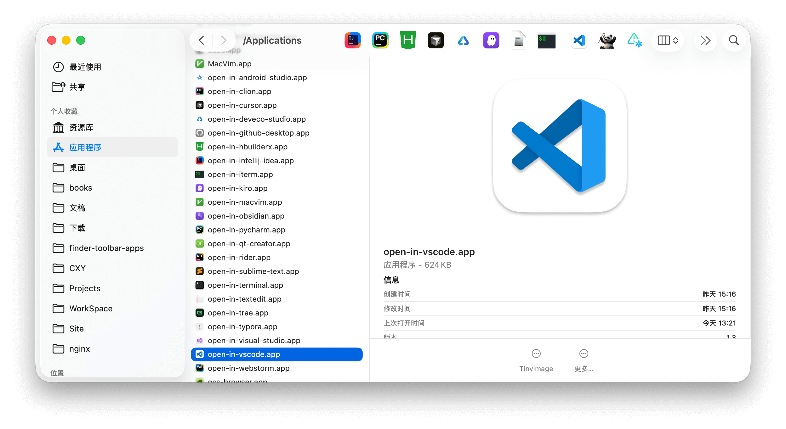

# macOS Finder Toolbar App Collection

macOS one-click quick action toolkit. A curated set of handy apps you can place in the Finder toolbar to quickly operate on files.

[中文 README](./README.md)

## Applications

- **open-in-** series (20+ apps): quickly open files or folders in a specific app (VS Code, Terminal, PyCharm, etc.)

- **app-to-dmg**: package a .app bundle or directory into a .dmg disk image

- **remove_quarantine**: remove the app quarantine attribute to fix "cannot open" issues

- **[TinyImage](https://github.com/iHongRen/TinyImage)**: lossless image compression to reduce file size



## Installation

1. Download and open [apps.dmg](https://github.com/iHongRen/finder-toolbar-apps/releases), then drag the desired app(s) to the `Applications/` folder


2. Hold the `⌘ Command` key and drag the `xxx.app` item to the Finder toolbar


3. Open Terminal and run the following command to remove the quarantine attribute (replace `xxx` with the installed app name):
   ```bash
   xattr -d com.apple.quarantine /Applications/xxx.app
   ```


## Usage

Select the file or folder in Finder that you want to act on, then click the app in the toolbar to perform the quick action.


